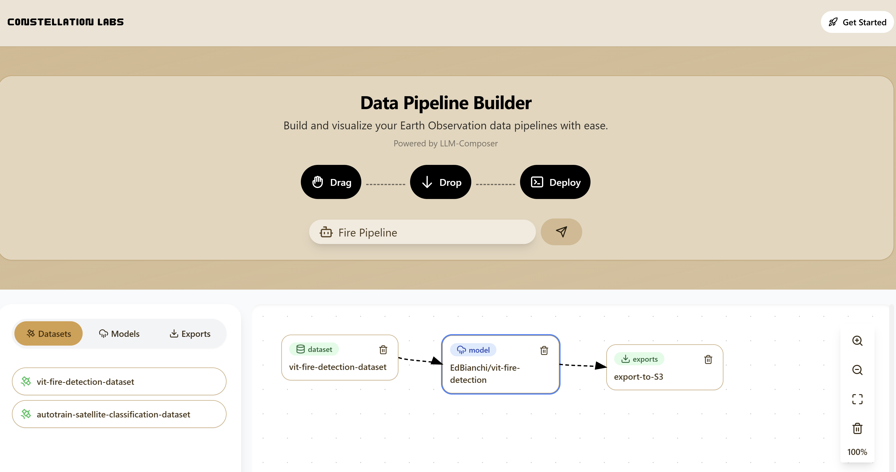

# 🌌 **Constellation Master Program**

##  **Overview**

Welcome to the **Constellation Master Program**! This master application orchestrates a suite of microservices to automate the use of machine learning models for satellite image inference. Our service allows users to connect datasets with models, and evaluate their outputs through a simple drag-and-drop interface supported by an integrated LLM. 
<p align="center">
  
</p>

---

## **Table of Contents**
1. [Overview](#overview)
2. [High-Level Design](#high-level-design)
3. [Prerequisites](#prerequisites)
4. [Installation Steps](#installation-steps)
4. [Codebase Navigation and Project Structure](#codebase-navigation-and-project-structure)
6. [Future Enhancements](#future-enhancements)
7. [Technologies and Tools](#technologies-and-tools)

## **High-Level Design**

Constellation relies on a Microservice Architecture with four component services: A Dagster Microservice, a Core-Backend Microservice, a Large Language Model (LLM) Microservice, and a Model Hosting Microservice.


## **Microservices Composition**

1. **Core Backend Microservice**

  - **Role**: Acts as the backbone of Constellation, this microservice provides data persistence, and facilitates interactions between other microservices as well as the front-end of our application.
  - **Responsibilities**:
    - Stores datasets, models, and user-created pipelines.
    - Allows for data retrieval from Supabase backend.
    - Manages interactions between the Dagster, LLM, and Model Hosting Microservice.

2. **Model Hosting Microservice**

  - **Role**: Leverages the Modal Cloud compute platform to facilitate the containerization and deployment of machine learning models.
  - **Responsibilities**:
    - Model containerization and versioning.
    - Deployment of inference endpoints.
    - Manages the deletion and creation of deployed model services.

3. **Dagster Microservice**

  - **Role**: Utilizes the task orchestration capabilities of Dagster to create end-to-end pipelines starting with data preprocessing and outputting the results of model inference.
  - **Responsibilities**:
    - Imports data from cloud storage platforms.
    - Automates data preprocessing and transformation.
    - Exports model inference results to cloud storage platforms.

4. **Agent (LLM) Microservice**

  - **Role**: Leverages Large Language Model (LLM) capabilities to present users with database and model options that meet their prompt constraints.
  - **Responsibilities**:
    - Streamlines model and database selection for the user.
    - Dynamic JSON generation for pipeline invocation.

## Prerequisites

Before getting started with installation, ensure you have the following installed and configured:

- **Python 3.9+**
- **Docker & Docker Compose**
- **Supabase Account**
- **AWS S3 Account** 

## Installation Steps

1. **Clone the Repository**

   ```
   git clone https://github.com/your-repo/constellation-backend.git
   cd constellation-backend
   ```

2. **Set Up Environment Variables**

    - Create an `.env` file in the `root` directory with the following:
    ```
    SUPABASE_URL=your_supabase_url
    SUPABASE_KEY=your_supabase_anon_key

    AWS_ACCESS_KEY_ID=your_aws_access_key
    AWS_SECRET_ACCESS_KEY=your_aws_secret_access_key

    DATABASE_URL=your_postgresql_url
    OPENAI_API_KEY=your_openai_api_key
    ```

4. **Run Docker Containers**

    ```bash
    docker-compose up --build
    ```

5. **Access Services**

  Once the docker-compose containers are built, the frontend can be accessed at: `http://localhost:3005

## Codebase Navigation and Project Structure

For those of you who want to understand how our software works, key code files are distributed across various parts of the repository. This section aims to facilitate quick navigation of our codebase. The "Core Code" section pinpoints the locations of essential code files that are crucial for understanding the primary functionality of each microservice.

### Dagster Task Orchestrator
- **Directory**: `dagster/orchestrator`
- **Core Code**: Located in the `assets` folder (`repository.py` and `orchestrator.py`).
- **API Endpoints**: Located in the `app` directory.

### Modal Service
- **Directory**: `modal`
- **Core Code**: Model construction, inference, and deconstruction logic is implemented in `utils.py`.
- **API Endpoints**: Available in the `app` directory.

### Frontend
- **Framework**: Built using Next.js.
- **Core Code**: Primarily resides in the `frontend/src` directory.

### Core-Backend Microservice
- **Directory**: `api`
- **Core Code**: Supabase-related functionality is in `backend/app` and `backend/app/utils`.
- **API Sublayer**: APIs that facilitate interaction between microservices are located in `app/feature/core`.

### LLM Microservice
- **Directory**: `api`
- **Core Code**: Implemented in `app/features/agent/crews`.

## **Future Enhancements** 

Currently, we have limited models and databases to select from. This respository proves a simple concept that has promising implications for researchers in the space field. Additionally, we hope to make this a user-based system which contains user account information. Our backend has been built with this future work in mind, containing attributes for user IDs that will be added later in future builds.

## **Technologies and Tools**

For further documentation or understanding of the underlying systems in this repository, these are all of the external code bases that our project are built upon.

- **[FastAPI](https://fastapi.tiangolo.com/)** 🚀: High-performance web framework for building APIs with Python.
- **[Dagster](https://dagster.io/)** 🛠️: Orchestrator for building, managing, and executing data pipelines.
- **[Docker](https://www.docker.com/)** 🐳: Containerization platform for consistent deployment environments.
- **[Supabase](https://supabase.com/)** ☁️: Backend-as-a-Service platform for database and authentication.
- **[Pydantic](https://pydantic-docs.helpmanual.io/)** 📄: Data validation and settings management using Python type annotations.
- **[Pytest](https://docs.pytest.org/en/7.1.x/)** 🧪: Testing framework for Python.
- **[Uvicorn](https://www.uvicorn.org/)** 🌪️: ASGI server for running FastAPI applications.
- **[Modal](https://modal.com/)** 🖥️: Infrastructure for running Machine Learning Model code in the cloud.
- **[AWS S3](https://aws.amazon.com/s3/)** 📦: Allows long term object storage for model outputs.