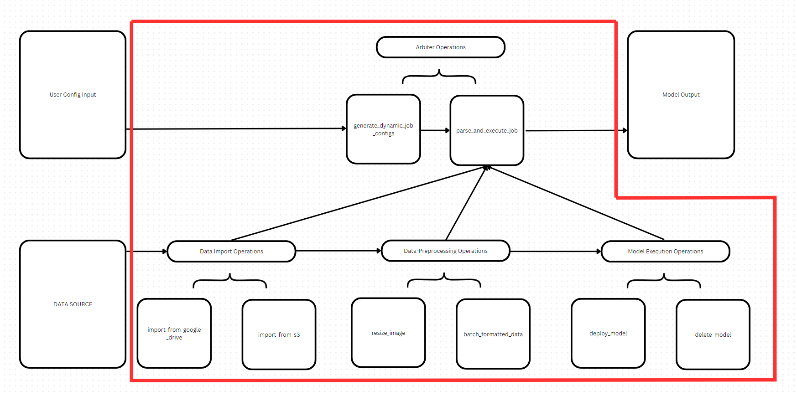

# Dagster Subsystem Design, Architecture, and Usage

## Table of Contents

- [Background](#background)
- [Install](#install)
- [Usage](#usage)
  - [Front-End Invocation](#front-end-invocation)
  - [Independent Invocation](#independent-invocation)
- [Unit Testing](#unit-testing)
- [System Architecture](#system-architecture)

## Background

The Dagster service is responsible for the seamless connection of data from databases to a preprocessing pipline, ultimately outputting and providing machine learning models with this structured data. Within the larger Agentic Earth software experience, we allow users to connect raw databases with various models of their choosing, allowing them to compare results from different models accross the same exact dataset to determine which model is appropriate to use. There is no guarantee, however, that each model requires the exact same input format - different preprocessing may be necessary on the underlying dataset to facilitate proper inference execution with various models.

## Install

Presumably talk about Docker/Poetry etc etc necessary for running this subsection @john2360

## Usage

@john2360

### Front-End-Invocation

Typically, this system will be invoked by a fastAPI call from the front-end interface that the user interacts with. A generated config from their proposed pipline will be sent to the dagster subsystem, and subsequently invoked.
@john2360

### Independent-Invocation

To run and test the isolated Dagster system we first must build our docker environment.

```bash
docker-compose up --build
```

After the containers have built, users can access the Dagster UI at "http://localhost:3000/". 

On the web-based user interface, the users will notice a folder named "main@constellation" in the upper left of the screen. This is the directory in which all jobs will be stored under. 

The "build_execute_job" is the primary assembler for our dynamic pipeline generation. When navigating to the "launchpad" tab where runs can be launched, the users are presented with a window to enter a config for their job. This will indicate to Dagster which operations need to be invoked for the given task.

All dynamic jobs will start with the following syntax. 
```bash
"ops": {
    "generate_dynamic_job_configs":{
        "config": {
            "raw_input":[
            ]
        }
    }
}
```

Within the "raw_input" users can then add operations which execute a single Dagster operation. One such operation could look as follows:

```bash
"ops": {
    "<operation_name>": {
        "config": {
            "raw_input": [
                {
                    "operation": "<operation_1>",
                    "parameters": {
                        "<param_name>": "<param_value>"
                    },
                    "operation": "<operation_2>",
                    "parameters": {
                        "<param_name>": "<param_value>"
                    },
                }
            ]
        }
    }
}
```
The parameters given to any operation is specified in their instantiation in "ops.py". When constructing a configuration for an operation users can determine the necessary fields based on the inputs given in the operation context. 

Additionally, operations can be nested within eachother as long as the resulting output from the nested operation resolves properly as the expected input for the outer operation. This would look as follows:

```bash
"ops": {
    "generate_dynamic_job_configs":{
        "config": {
            "raw_input":[
                {
                    "operation": "model_inference",
                    "parameters": {
                        "model": "<model_name>",
                        "data": {
                            "operation": "dict_to_list",
                            "parameters": {
                                "data": {
                                    "operation": "import_from_google_drive",
                                    "parameters": {
                                        "file_id": "<file_ID>",
                                    },
                                }
                            }
                        }
                    }
                ]
            }
        }
    }
```

In this example, model_inference takes in the resulting output type from dict_to_list, and dict_to_list takes in the resulting output type from import_from_google_drive. This allows users to string together many operations to perform complex data transformations while letting Dagster handle their sequential execution.

Using the simple structures outlined above, below is an example of a working pipline that deploys a model, reads in data, performs simple transformation, and then runs inference on the downloaded data before finally deleting the model.

```bash
"ops": {
    "generate_dynamic_job_configs": {
        "config": {
            "raw_input": [
                {
                    "operation": "deploy_model",
                    "parameters": {
                        "model": "EdBianchi/vit-fire-detection"
                    }
                },
                {  
                    "operation": "model_inference",
                    "parameters": {
                        "model": "EdBianchi/vit-fire-detection",
                        "data": {
                            "operation": "dict_to_list",
                            "parameters": {
                                "data": {
                                    "operation": "import_from_google_drive",
                                    "parameters": {
                                        "file_id": "1aniasD6RcD3Zr7K8DSWiiqtXCRbFx7gU",
                                    },
                                }
                            }
                        }
                    }
                },
                {
                    "operation": "delete_model",
                    "parameters": {
                        "model": "EdBianchi/vit-fire-detection"
                    }
                },
            ],
        }
    }
}
```

### Unit-Testing

To run our battery of unit tests, simply run the following command in the assets directory:

```bash
pytest
```

Tests are contained in op_tests.py and new tests can be added as operations are created.


### System-Architecture
Below is a diagram outlining our model for our Dagster system architecture.



Rather than the typical class structure used, we rely on the Dagster convention of using “operations.”  Elements composed under a bracket are similar in function and perform one of four, key, suboperations: Arbiter Ops, Data Import Ops, Data-Preprocess Ops, and Model Execution Ops.

Larger elements (Not in the red box) such as the User Config Input, Data Source, and Model Output are external to the core function of our process. These are expected inputs and outputs dependent on running our pipeline.

We expect additional operations to be added to the import, preprocessing, and model execution operations. The logic for our arbiter blocks is likely complete

**Arbiter Operations**:

Key Operations which are responsible for taking in user input, stringing together sub-operations, and outputting the final results from model inference.

- *generate_dynamic_job_configs*
    - interfaces directly with text configs passed in by the user (based on their interactions with the front end of the application)
    - Passes formatted instructions into parse_and_execute_job
- parse_and_execute_job
    - Takes in instructions, and executes all listed operations in sequence, interfacing with every other block in the pipeline. This operation invokes all other subcalls and returns the final output

**Data Import Operations**

Operations which support the import of data from various data streams. The backend team for this project is responsible for ensuring data is imported and formatted appropriately in an accessible location.

- import_from_google_drive & import_from_s3:
    - Download, unzip, and store data in the formatted expected by the Data-Preprocessing Operations

**Data Preprocessing Operations**

These operations are responsible for translating raw data into the format expected by the given model. 

- resize_image & batch_formatted_data:
    - These are two expected operations that will be necessary to translate from raw-unprocessed data to the format a model expects

**Model Execution Operations**

These operations are responsible for passing data to the model endpoint via rest API calls

- deploy_model & delete_model:
    - These operations ensure that data is passed successfully between our Dagster pipeline and the model endpoint. Once complete, the model is deleted.


Standard Readme follows the [Contributor Covenant](http://contributor-covenant.org/version/1/3/0/) Code of Conduct.

[](https://github.com/RichardLitt/standard-readme)
